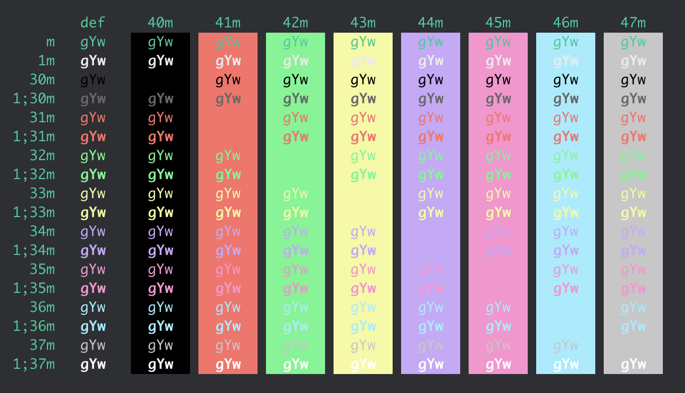

# Beenine

Beenine is a color scheme for iTerm2 that exists so this repository's name can be used as example text by [Schemarin](https://github.com/celsiusnarhwal/schemarin). Does it look good? Arguable. Does it serve its purpose? Absolutely.

# Installation

### Schemarin

Launch Schemarin and follow the prompts to add color schemes from a GitHub repository. When prompted for the repository's name, enter `celsiusnarhwal/beenine`.

### Manual Installation

Clone this repository, then open iTerm2 and go to `Preferences` > `Profiles` > `Colors` > `Color Presets...` > `Import...`. Navigate to `Beenine.itermcolors` and click `Open`.

## Preview

Check it out.

## License

Beenine is licensed under the [WTFPL](https://github.com/celsiusnarhwal/beenine/blob/HEAD/LICENSE.md).
